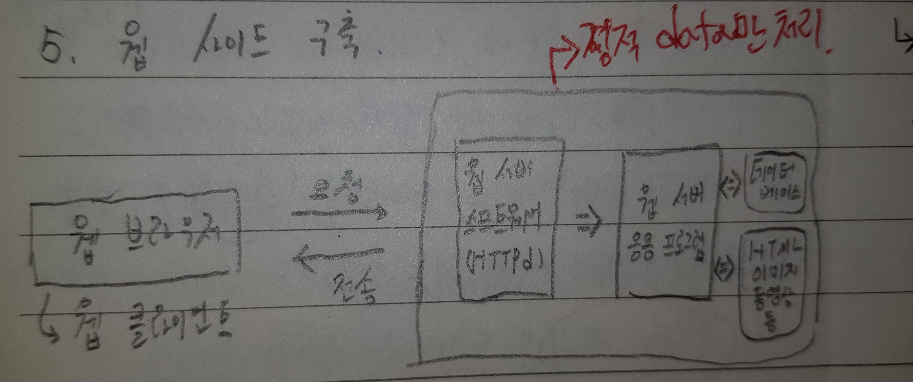
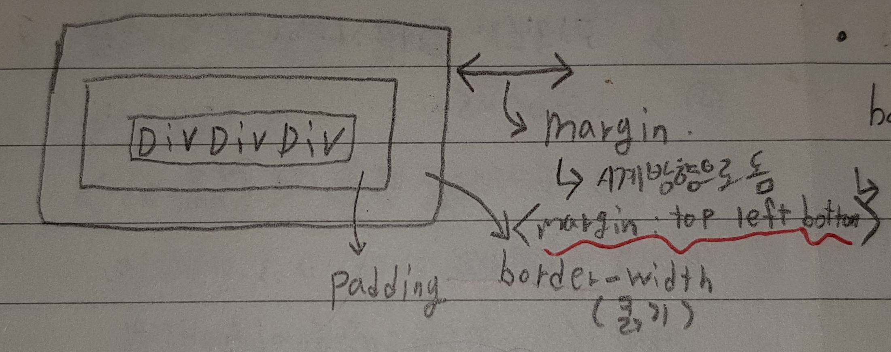

# 웹 프로그래밍

---

> 

### 웹의 목적

1. 여러 컴퓨터에서 문서를 공유하거나 보기 위해 사용 
2. 웹어세 다루는 문서 = 웹문서 

### 웹의 구조

1. 네트워크가 기반이 되어야 웹을 다룰 수 있다. 
2. 인터넷을 활용하여 여러 네트워크를 연결하는 정보 소통 망 
   - 웹 문서를 네트워크를 이용해 주고받는 시스템 

### 웹의 구성

1. 웹서버 ( ex) google, naver )
   - 웹 사이트를 탑재하는 컴퓨터 
   - 웹 클라이언트의 요청을 받아 웹 문서 전송 
   - 웹 문서, 이미지 , 동영상 등의 데이터 저장 관리 
   - 접속시, 웹 서버로 작동하는 소프트웨어 실행
2. 웹 클라이언트 
   - 사용자 인터페이스 담당 

### 인터넷 

1. 인터넷과 웹의 차이점 
   - 인터넷이 고속도로라고 하면 , 웹은 고속도로를 이용한 물류사업이다.
   - 웹은 응용 서비스 이다. 
2. 웹의 개념 전부터 만들어진 컴퓨터 연결 네트워크 
3. 컴퓨터마다 고유 IP 를 가진다. 
4. 응용 서비스 종류 : 전자우편, 파일전송, 채팅, 스트리밍 메신저 등 ) 

### 웹 사이트 구축



### 웹 서버 소프트웨어

- 웹 서버 소프트웨어 VS 웹 서버 응용 프로그램 
  - 소프트웨어 : 중축 
  - 응용프로그램 : 요구를 받아 데이터 가져오는 것 ( 이미지, DB 같은거 )

1. 웹 브라우저로부터 요청을 해석 

2. 필요한 웹 서버 응용프로그램 작도

3. 웹 서버 응용프로그램 결과를 웹 브라우저로 전달 

### URL 이란

- 웹 페이지 주소를 뜻한다. 
- 형태 
  - "http://www.oracle.com:80/my/network/java/index.html"
    - http : 프로토콜
    - www.oracle.com : 서버 주소                                                                                                                                                                                                                                                                                                                                                                                                                                                                                                                                                                                                                                                                                                                                                                                                                                                                                                                                                                                                                                                                                                                                                                                                                                                                                                                                                                                                                                                                                                                                                                                                                                                                                                                                                                                                                                                                                                                                                                                                                                                                                                                                                                                                                                                                                                                                                                                                                                                                                                                                                                                                                                                                                                                                                                                                                    
    - :80 : TCP/IP 포트번호 
    - my/network/java : 경로명 (웹 서버 내의 웹 페이지 파일의 폴더 경로 )
    - index.html : 웹 페이지 파일 이름 


### WAS

1. WAS ( Web Application Server )

2. WAS = 웹 서버 + 웹 컨테이너

   1. 웹 서버 ( 프리젠테이션 로직 )
      - 클라이언트에게 정적 텍스트를 제공 
      - 컨테이너에 동적 컨텐츠 제공을 위한 요청 전달 
   2. 웹 컨테이너 ( 비지니스 로직 )
      - 동적 웹 페이지를 만들기 위해 필요 
      - JSP , Servlet 이 있다. 

   |         프리젠테이션 로직          |      비즈니스 로직       |
   | :--------------------------------: | :----------------------: |
   |           웹 서버가 담당           | 애플리케이션 서버가 담당 |
   |       Apache, Server, lls 등       |       업무를 처리        |
   | 프로그램 실행환경, DB접속기능 제공 |          Tomcat          |
   |          정적 텍스트 전달          |     동적 텍스트 전달     |

   - 웹서버 자체는 프리젠테이션 로직만 담당하고, 비즈니스 로직을 담당하기 위해서는 웹 컨테이너가 필요하다. 
   - 웹 컨테이너가 있어야만 DB를 사용할 수 있다. 

### 웹 클라이언트 페이지 구성요소 

1. HTML : 웹 페이지의 구조와 내용 
2. CSS : 웹 페이지의 모양 ( 문서를 예쁘게 만들기 위해 사용 )
3. JavaScript : 웹 페이지의 행동 응용프로그램 
   - 동적인 텍스트 기능을 추가 
   - 역동성을 더해 더 화려하게 꾸밀 수 있게 한다. 

# HTML

### HTML 태그 구성 

- img src="heee.jpg" width="100" alt="툴팁표시합니다."
  - img : 태그 이름 
  - src : 속성 
  - heee.jpg : 속성값 
  - width : 속성 

### 태그 특징 

1. 시작태그와 종료태그 있는 경우 
   - \<html> \</html>
2. 시작 태그만 있는 경우
   - \<br>
3. 태그와 속성은 대소문자 구분 안함 
4. 불필요한 공백이 많을경우 표준에 어긋남 

### 태그 종류 

- 블록태그 : p, div, h1, ul
- 인라인 태그 : strong, span, a, img 

```
<title>
<h1> ~ <h6> : 제목
<p> : 강조
<pre> : 사용자가 입력한 대로 출력 -> 2번의 띄어쓰기 재대로 나오게 함 
<b> : 굵기
<del> : 선긋기 
<ins> : 추기
<mark> : 하이라이팅
<base>, <link>, <script>, <style>, <title>, <meta> : 메타데이터 (데이터를 설명하는 부분 )
<OL>, <UL>, <dl> : 리스트 ( li와 함께 쓰임 ) 
	ol : 순서있는 리스트 
	ul : 순서없는 리스트 
	dl : 정의 리스트 ( dt와 dd태그 사용 가능 )
<table> : 표
	th : 표의 헤더를 나타냄 
	tr : 표의 행을 나타냄
	td : 표 안에 들어갈 데이터를 나타냄 
<a> : 하이퍼링크 ( href와 함께 쓰임 )
<frame> : 하나의 창 안에서 여러 창 띄우기 ( 창 안에 또다른 창 만드는 기술 )
<video>,<audio> : 미디어 삽입 ,오디오 삽입 
	<audio src="ddd.mp3" controls autoplay loop> : 컨트롤러를 표시하며 자동재생진행 후 반복한다. 

```

### 문서의 구조 

```
<head> : 전체 제목과 소재
<section> : 본문전체 
<article> : 본문안에 내용을 절로 나눔
<nav> : 링크나 메뉴 , 목차 
<audio> : 배경음악 
<aside> : 노트 ( 자세한 내용 )
<footer> : 참고문헌 
```

### 웹 폼

1. 웹 페이지에서 사용자 입력을 받는 폼 

   - 로그인, 등록, 검색, 예약 기능 등이 있다 

2. 형태 

   1. name : 폼의 이름을 설정 
   2. method : 데이터 전송 방식 
      1. get : 전송속도 빠르지만 URL에 보내는 정보가 보여 보안에 취약하다.
      2. post : 전송속도가 get보다 느리지만 URL에 보내는 정보가 보이지 않아 보안에 용이하다. 
   3. action : 입력한 데이터들이 보내지는 URL 주소 

3. 기능들 

   - input 태그의 type 종류 => \<input type="text"> 

     1. submit
     2. reset
     3. password
     4. tel
     5. button
     6. text
     7. email 등 

   - ```html
     <form>
         <!-- datalist 이용 -->
         <datalist id="country">
             <option value="가나">
             <option value="한국">
         </datalist>
     
         <input type="text" list="country"> <!-- datalist 에있는 country내용을 가져옴  -->
     
         <!-- checkbox  -->
         짜장면<input type="checkbox" value="1">
         짬뽕<input type="checkbox" value="2">
     
         <!-- Select  -->
         <select name="food">
             <option value="1">짜장면</option>
             <option value="2">짬뽕</option>
         </select>
     
          <!-- label : 하나의 블록으로 묶기  -->
         <label>사용자 iD : <input type="text"></label>
         
         <!-- 색 코드 폼  -->
         <input type="color" value="0000">
         
         <!-- 시간 정보 입력 폼 -->
         <input type="month"> => 년/월
         <input type="date"> => 년/월/일
         
         <!-- 스핀버튼, 조절버튼  -->
         <input type="number" min="0.0" max="0.0" step="0.5">
         <input type="range" min=0 max="10">
         
         <!-- 이메일  => url, tel, search 로 변경 가능 -->
         <input type="email" placeholder="xxx@naver.com">
         
         <!-- 폼 요소의 그룹화  -->
         <fieldset>
         	<legend>
                 회원정보 
             </legend>
             이메일 < input type="email">
         </fieldset>
         
     </form>
     ```

# CSS 

1. CSS ( Cascading Style Sheets )
2. html 문서의 색이나 모양 등 외관을 꾸미는 언어 
3. Css로 작성된 코드를 "스타일 시트 " 라고 부른다. 

```css
<style>
body{
    background: gray;
    color: red;
}
h3{
    color:red;
}
</style>
```

### 특징 

1. : 를 사용 함 
2. 새로운 기능을 정의함 
3. ; (세미콜론) 으로 끝내야함 
4. \<head> 태그 안에서만 사용해야함 

### CSS 적용하는 방법 

1. style 태그 이용 

2. 태그의 style 속성 이용 

3. 스타일 시트 파일 불러오기 

   ```html
   <!--1. style 태그 이용  -->
   <head>
       <style>
       	h3{
       		color:red;
   		}
       </style>
   </head>
   
   <!-- 2. 태그의 style 속성 이용   -->
   <div style="color:red; font-size:20px;">ddd</div>
   
   
   <!-- 3. 스타일 시트 파일 불러오기  -->
   <link href="파일이름.css" type="test/css" rel="stylesheet">
   <style>
   	@import url(파일이름.css);
   </style>
   
   ```

### 우선순위 

1. 태그의 style속성 
2. style 태그 
3. 외부 css 데이터 
4. 디폴트 

### 셀렉터 

- HTML 태그의 모양을 꾸밀 스타일 시트를 선택하는 기능 

- 종류

  1. 전체 셀렉터
  2. 속성 셀렉터
  3. 자식, 자손 셀렉터

  ```css
  *{ // 전체 셀렉터
      color:red;
  }
  
  input[type=text]{ // 속성 셀렉터
      color:red;
  }
  
  div > div{ // 자식 셀렉터 : 직계 자식에만 적용 => div 밑에 div에만 적용됨 
      color:red;
  }
  
  div div{ // 자손 셀렉터 : 자식, 후손 모두 포함 => div 밑에 div에 포함된 모든 태그에 적용
      color:red;
  }
  ```

### Class vs ID

- Class 

  - id보다 넓은 범위의 태그들에 적용함 
  - 일반적으로 여러개의 태그에 동시적으로 적용하고자 할 때 사용 
  - .(점) 을 사용해서 css 를 적용한다. 

- Id

  - 작은 범위의 태그들에 사용됨 
  - 일반적으로 하나의 특정 태그에 적용하고자 할 때 사용 
  - #(샾) 을 이용해서 사용

  ```css
  body .war{ // body 안에있는 war라는 클래스에 적용 
  	color: red;
  }
  
  body #war{ // body의 war라는 id를 가진 태그에 적용
      color:red;
  }
  ```

### 조건이나 상황에 따른 스타일 적용 

1. : ( 콜론 ) 으로 시작한다. 

```css
a : visited{ // 방문한 링크 텍스트 색을 변경 
    color:red;
}
li : hover { // 마우스 올려놓으면 실행 
    color: red;
}
li : focus{ // 해당 태그가 포커스 되었을 경우 실행 
    color:red;
}
li : action{ // 마우스로 누르는 상황에서 발생 
    color:red;
}
li : first-letter{ // 첫 글자를 red 로 변경 
    color:red;
}
```

### 폰트 사이즈 

- 기본으로 px로 지정
- em : 배수를 의미한다. 3em = 현재 폰트의 3배 

## 박스 모델 

- 

### 모든 콘텐츠는 박스의 형태로 되어있다. 

- padding : 콘텐츠와 border 사이거리
- margin : border와 다른 박스와의 사이거리
- border : 박스의 테투리 굵기 

### 테두리 종류

- \<p style="border : 15px solid blue">
- solid : 실선
- hidden : 숨기기
- none : 숨기기
- dotted : 점선
- dashed : 굵은 점선 
- double : 2줄
- groove : 각지게 
- ride : 밖으로 각지게 
- inset : 안으로 들어가게 
- outset : 튀어나오게 

### 테두리 모서리 모양 조절 

- border-radius : 0px 4px 5px 6px
  - 왼쪽 위 0px 만큼 둥글게 
  - 오른쪽 위 4px 만큼 둥글게 
  - 오른쪽 아래 5px 만큼 둥글게 
  - 왼쪽 아래 6px 만큼 둥글게 
- border-radius : 0px 4px 
  - 위, 아래 0만큼 둥글게
  - 왼쪽, 오른쪽 4px 만큼 둥글게 

### 박스 유형 

- 인라인 박스 
  - 새 라인에서 시작 못함 
  - 모든 박스 내부에 위치 가능 
  - 옆에 다른 요소 배치 가능
  - width와 height 조절 불가능 
  - margin  조절 불가능  
- 블록 박스 
  - 항상 새 라인에서 시작 
  - 블록박스 안에서만 배치 
  - 옆에 다른 요소 배치 불가능 
  - width와 height 조절 가능 
  - padding , margin , border 조절 가능 
- 인라인-블록 박스 ( 인라인과 블록박스의 좋은 특징을 결합 )
  - 새라인 시작 안함 
  - 모든 박스 내에 배치 가능 
  - 옆에 다른 요소 배치 가능 
  - width 와 height 로 크기조절 가능 
  - padding, margin , border 조절 가능 

### 박스 배치 

1. nomal flow : 웹 페이지에 나타난 순서대로 html 태그 배치 
   - position 태그로 nomal flow 무시 가능 
2. position 프로퍼티 
   - 정적배치 = position : static (디폴트)
   - 상대배치 = position : relative => 기본 위치를 기준으로 배치 
   - 절대배치 = position : absolute => 상위 배치에 따라 배치
   - 고정배치 = position : fixed => 원래 위치와 상관없이 설정 
   - 유동배치 = float : left or right

# JavaScript

### 정의

- 앞에 HTML, CSS 가 보여주기 위한 기본 틀 이라면, 자바스크립트는 역동성을 더해 더 화려하게 꾸미는 것이다. 

### 특징 

1. html 문서에 내장 ( 조각 소스 코드 )
2. 스크립트 언어 ( 컴파일 필요 없음 )
   - 컴파일 문장은 반드시 ; 으로 마감해야한다. 하지만 자바스크립트는 컴파일 필요없기 때문에 생략가능하다. 
3. 단순하다. ( c언어 구조와 비슷, 배우기 쉬움 )

### 사용되는 위치 

1. 태그의 이벤트 리스너 
   - \<div onclick="this.src='banana.png'">
2. \<script> 태그 안에서
3. 자바스크립트 코드가 작성된 별도의 파일 
   - \<div src="파일명.js">
4. \<a> 태그의 href 속성에서 
   - \<a href="javascript:alter('hi')">

### 자바스크립트 다이얼로그 함수 종류 

1. prompt("메시지", "디폴트 입력값")
2. confirm("메시지")
3. alert("메시지")


### 자바스크립트 식별자

1. 식별자란?
   - 변수 선언시 사용할 이름
2. 총 64개로 구성 
   - (A-Z, a-z) + 숫자 0~9 + "_" + "$"
3. 첫 문자는 알파벳, "_", "$"만 사용가능 
4. 대소문자를 구분한다. 
5. 예약어 사용 불가 

### 자바스크립트  변수 

1. 자바스크립트는 변수에 타입을 지정하지 않는다. 
   - var arr = new Array() 같이 여러가지 데이터타입을 var로 통일해 사용한다. 
2. 지역변수, 전역변수 
   - 지역변수 : 함수 내에 var 키워드로 선언된 것 
   - 전역변수 : 함수 밖에서 선언되거나, 함수 내에서 var로 선언되지 않은 경우 

### html 태그 구성요소 5가지 => \<div style="color:red;" onclick="go()" > abc < /div>

1. 태그 (엘리먼트 )  : div
2. 속성 : style
3. css3스타일 : color:red;
4. 이벤트 리스너  : onclick
5. 콘텐츠 : abc

### Html 페이지 로딩 과정 

1. 브라우저가 html 페이지 로드 전 빈 상태의 document 생성
2. 브라우저가 html 페이지를 위에서 아래로 해석
3. html 태그들을 document 객체에 담아감 ( Dom 객체 생성)
4. \</html> 태그 만나면 document 객체를 완성하고 닫는다. 

### 자바스크립트 객체 종류 

1. 코어
2. Dom ( Document Object Model )
3. Bom (비표준 객체로 브라우저를 제어하기 위해 사용 )

### 코어

- 기본객체로 표준객체이다. 
- Array, Date, String 타입이 있다. 
- 객체의 생성을 var today = new Date(); 로 생성한다. 
- 객체의 접근은 . (점) 을 이용해 접근한다. 
  - today.length

### Dom ( Document Object Model )

- HTML 문서에 사용되는 태그들을 가리킨다. 

  - \<html>, \<head>, \<div> 등

- 트리구조로 이루어져 있다. ( 부모 , 자식관계 )

- Dom 객체의 구성요소 

  1. 프로퍼티 : html 태그의 속성 반영 
  2. 메소드 : Dom객체의 멤버 함수로, html 태그 제어 가능 
  3. 컬렉션 : 자식 Dom 객체들의 주소를 가지는 등 배열과 비슷한 집합적 정보
  4. 이벤트리스너 
  5. Css3 스타일 

- Dom 객체의 삽입, 삭제 

  - 삽입 => p.appendchild(객체)
  - 삭제 => p.removechild(객체)

- 사용방법

  ```javascript
  var divtotal = document.getElementsById("divId")
  var divtotal = document.getElementsByTagName("divId")
  var divtotal = document.getElementsByClassName("divId")
  var len = divtotal.length
  ```

- This 키워드 

  1. Dom객체에서 자신을 가리키는 용도로 사용 

### 이벤트 리스너 

1. 이벤트 : 사용자의 입력행위나 문서, 브라우저의 상태변화를 자바스크립트 코드에게 알리는 통지 

2. 이벤트 리스너 : 발생한 이벤트에 대처하기 위해 작성된 자바스크립트 코드 

   - 이벤트 리스너 이름은 이벤트 앞에 on 을 붙인다. 
   - ex) click 이벤트 = onclick

3. 이벤트 리스너 만드는 방법  종류

   1. html 태그 내에 작성 

      ```html
      <p onmouseover="this.style.color='red'" onmouseout="this.style.color='blue'">
      ```

   2. Dom 객체의 이벤트 리스너 프로퍼티 이용 

      ```html
      <p id="tagP"> 마우스 </p>
      <script>
      	function over(){
              alert('마우스 오버')
          }
          var p = document.getElementById("tagP");
          p.onmouseover = over; // over() 라고 하면 안됨 ㄴ
      </script>
      ```

   3. Dom 객체의 addEventListener()

      ```javascript
      p.addEventLisener("mouseover", over, true);
      // 이벤트 이름 , 함수
      // true 면 캡쳐단계에서 실행될 리스너 등록
      // false 면 버블 단계에서 실행될 리스너 등록 
      ```

   4. 익명함수로 이벤트 리스너 작성 

      ```javascript
      p.onmouseover = function(){
      	this.style.color = red;
      }
      
      p.addEventLisener("mouseover", function(){
      	함수 내용 
      }, true)
      ```

4. 이벤트 흐름 

   

   1. 이벤트가 발생하면 window 객체에 먼저 도달하고, Dom 트리를 따라 이벤트 타깃에 도착한다. 
   2. 타깃에 도착한 후 다시 반대로 흘러 window 객체에 도달한 다음 사라진다. 
   3. 캡쳐 단계 ( 실행 )
      - 이벤트가 타겟에서 window 객체에 전달되는 과정 
   4. 버블 단계 ( 소멸 )
      - 거져가는 모든 Dom 객체 이벤트 리스너 실행 

5. Onload

   - window 객체에 발생하여 웹 페이지 로딩이 완료되면 호출된다. 

 
