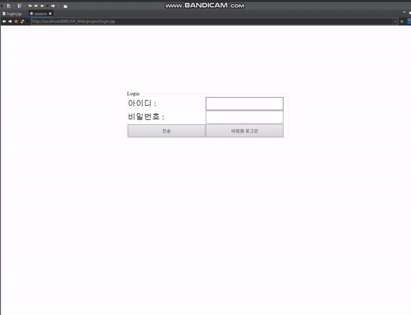

# 웹 서버 프로젝트

---

구분 : 개인 프로젝트

## 프로젝트 정보

---

### 1.프로젝트 주제

- 온라인 시대의 단점을 극복할 수 있는 책 추천 사이트 

### 2. 주제 선정배경 또는 이유

-  최근 기술이 발전하면서 현대인들은 바쁘게 살아가고 있고, 온라인에서 많은 시간을 보내고 있습니다. 온라인에는 재밌고 자극적인  콘텐츠가 많이 존재합니다. 자극적인 정보는 우리에게 도움이 될 수도 있지만 필요하지 않은 정보일  수도 있습니다. 따라서 현대인들은 온라인에서 의미 있는 시간을 보내기 보다는 쉽게 얻을 수 있고  재미있는 자극적인 정보에 많은 시간을 보내게 됩니다.   예를 들어 유튜브가 있습니다. 유튜브에는  좋은 정보들도 있지만, 필요치 않은 정보와 자극적인 정보도 다수 존재합니다. 이런 상황이 반복되면 필요하지 않은 정보에 시간을 많이 사용하게 될 것입니다.   불필요한 시간을 인지하고, 그  시간을 더 값진 시간으로 바꿀 수 있는 책 이라는 요소를 소개하려고 합니다. 최종적으로는 코로나  시대에 맞춰 온라인으로 책을 접할 수 있는   e북을 시스템을 이용해 책을 추천하려고 합니다.   

### 3. 프로젝트 개요

-   자극적이고 유흥거리의 정보는  순간의 즐거움을 주겠지만, 그 시간이 늘어난다면 우리에게서 많은 시간을 빼앗아간다.  이런 불필요한 시간을 인지하고 그  시간을 더 값진 시간으로 바꿀 수 있는 책이라는 요소를 소개하기 위해서 프로젝트를 진행했다. 

### 4. 프로젝트 환경 및 사용된 툴

| 언어      | 웹              | 데이터 베이스 | 개발 도구 |
| --------- | --------------- | ------------- | --------- |
| Java, SQL | HTML5, CSS, JSP | MySQL         | Eclipse   |

### 5. 개발 내용

1. 로그인  
   - Jsp를 이용해 사용자가 입력한  아이디를 해당 jsp 페이지로 보내 jsp페이지에서 입력한  정보를 이용한다.   
2. Header.jsp
   -  헤더 부분에 들어갈 jsp를  별도의 파일로 만들었다. 이 파일은 왼쪽에 고정 바 형식으로 자리잡는다. 고정바는 css 로 만들어주었다. css파일도 한번에 묶어 여러 군데에서 css를 동일하게 사용하게  하였다. 헤더의 내용은 사용자가 입력한 아이디가 있다면 그것을 고정 바 상단에 띄워줘서 어떤 사용자가  이용하는지 알려준다. 또한 뒤에서 소개할 3가지의 카테고리와  메인 페이지로 돌아올 수 있는 링크를 만들어 배치해줬다. 이 배치 또한 애니메이션 기법과 hover 기법을 이용해 박스를 유동적으로 꾸며주었다. 고정바의  배치로 인해 주 컨텐츠 내용 또한 그만큼 이동해서 출력되야 하기 때문에 css로 고정바와 겹치지  않도록 해주었다.   
3. main.jsp
   - 이 부분은 크게 3가지의  카테고리를 소개한다. 1.현대사회의 문제점, 2.국립도서관  추천도서, 3.다른 사이트의 추천도서 이렇게 3가지로  나뉘게 된다. 먼저 보기 좋게 테이블 형식을 이용하였다. 테이블  또한 hover기법을 이용해 border들이 변경될 수  있도록 하였다. 여기서 3번째 카테고리인 다른 사이트  추천 도서는 2번 카테고리의 정보를 이용하므로, 사용자가  바로 이용해서는 안된다. 따라서 3번째 카테고리를 클릭했을  경우 confirm 을 이용해 선택권을 주고, 취소를  눌렀을 경우 해당 이벤트인 click을 취소시키도록 구성하였다.   
4. Footer.jsp
   - 페이지에 삽입되는 형식으로,  header와 비슷한 고정 바 기능을 사용하였다. header와는 다르게 기능은 많이  않으나, 프로젝트에서 사용했던 자료들의 출처와 현재 시간을 알려주는 기능을 사용하였다. 현재시간은 자바빈즈를 이용하여 자바 클래스 형식으로 현재 시간을 simpledataformat으로  내가 원하는 형태로 만들어 주었고, 그 시간을 get해줘서  시간을 표기하도록 하였다. 이 시간은 각 페이지가 요청될 때마다 현재 시간을 계산해주게 된다.   
5. 첫번째 카테고리 => Problem.jsp
   - 이 부분은 현대사회의 문제점을 알려주기 위해 만들었다. 3개의 뉴스 자료로 구성되며, 해당 자료를 클릭할 시 해당 페이지를  띄워주도록 하였다. 이때 현재페이지에 띄우는 것이 아니라 새로운 창으로 띄우기 위해 target을 이용하였다. 귀찮아서 뉴스의 결론을 보고 싶은 사람을  위해 밑에 결론 보러 가기를 만들어 problem_sub.jsp로 이동하도록 하였다. 이 서버 페이지는 사용자가 더 이용 할 것인지 아니면 그만 이용할 것인지를 선택할 수 있도록 하였다. 더 보고 싶다면 책을 추천 받을 수 있는 book.jsp로 갈수  있도록 하였고, 아니라면 로그아웃을 하여 그만할 수 있도록 만들었다.   
6. 두번째 카테고리 => Book.jsp
   - Book.jsp는 본격적으로 책을 추천하기  위해 사용자로부터 입력을 받는 단계이다. 테이블 기법으로 정렬해 주었고, fildset을 이용해 어떤 것을 해야 하는지도 간략하게 제목으로 보여주었다. 사용자가 원하는 책의 타입과 추천 받을 책의 권수를 선택하면 선택한 정보로 데이터베이스에서 정보를 검색해  가공된 정보를 보여준다.   
7. Book_read.jsp
   - 사용자가 선택한 값을 이용해서 데이터베이스에 접근하여 원하는 정보를  가공하여 테이블 형태로 추가해주었다. 사용할 테이블은 국립중앙도서관 사서가 추천한 책을 저장하고  있는 데이터이다.   이때 세번째 카테고리에서 사용자가 입력한 정보들을 받아서 사용할 수  있도록 session 기법을 이용해 주었다.데이터 베이스와  연결하기 위해 dbconn.jsp를 디렉티브 태그로 추가해 주었고,  데이터 베이스와 연결한 후 , 반복적으로 사용할 수 있는 prepareStatement 를 이용해서 sql문을 만들어주었다. 데이터 베이스로 sql문을 보내고 그 결과값으로 값들을 행 단위로  원하는 정보만 가져온다. 여기서 이용할 정보는 책 타입, 제목, 저자이다. 이 데이터를 저장하기 위해 배열을 만들었으며, 배열을 이용해 스크립트 태그안에서 테이블의 형태로 출력해주었다.   
8. showDB.sql
   - 데이터 베이스를 쉽게 만들 수 있는 공간이다. 먼저 첫번째 테이블인 국립중앙도서관 데이터는 총 7개의 열로 만들었으며, 책의  타입,제목,작가,출판사,발행연도,추천일순으로 정보가 저장되어 있다. 데이터베이스를 편리하게 이용하기위해 이클립스에서 showDB.sql이라는  파일을 만들어주었고, 이 파일에서 테이블과 데이터를 삽입 삭제하며 필요한 데이터베이스를 만들어주었다. 만든 테이블은 총 3가지로, 국립중앙도서관  테이블, 교보문고 테이블, 밀리 서제 테이블이다.  
9. 세번째 카테고리 => book_otherSite.jsp
   -  사용자가 번거롭게 다시 선택하지 않도록 전에 입력 받은 값을 세션에서  가져와 사용하였다. 받아온 값으로 데이터베이스에 있는 2개의  테이블(교보문고, 밀리 서제) 에서 데이터를 가져올 것이다.   2가지의 테이블에서 데이터를  가져올 것이기 때문에 반복문을 사용해 주었고, 반복문마다 테이블의 이름이 달라지도록 설정하였다. 이때 추천 책 정보와 어디서 추천하는 책인지 알려주었다.  

### 6. 구현 결과

#### 1. 사용자 UI

1. 로그인

   -   로그인부분 입니다. 이 부분에서는 아이디와 비밀번호를 입력하고  전송을 누르게 되면 지정한 jsp페이지의 버퍼로 보내게 됩니다. 그  버퍼에서는 header.jsp 라는 곳에서 회원의 아이디를 기억하고 있어서 왼쪽 부분에 나오는 카테고리  상단에 회원의 아이디를 출력해 줍니다. 또한 아무것도 입력하지 않고 비회원 로그인을 누를 시 “비회원” 으로 출력되게 했습니다.   

   

2. main

   - 메인 홈 부분입니다. 이 부분에서는 header와 footer 를 포함하여 위치를 고정하였고, content의 위치를 해당 header와 footer에 맞게 조정하였습니다. 각 테이블에 마우스를 올려놓으면 hover로 인해 색이 변경되도록 하였습니다. 또한 왼쪽에 있는 메뉴바를 이용해 해당 jsp페이지로 이동할 수 있게 구성하였으며, 포커스가 가면 애니메이션 효과를 이용해 나오도록 구성하였습니다. 콘텐츠의 3번째부분에있는 e북추천은 2번째 카테고리인 국립도서관 추천도서jsp 데이터를 이용하기 때문에 바로 클릭할 시 사용자에 여부를 물어보고 해당 클릭 이벤트를 취소할 수 있도록 만들었습니다

   

   

3. 온라인의 문제점 지적 

   - 첫번째 카테고리인 온라인의 문제점 부분입니다. 모든 스타일들은 css파일을 이용해 간편하게 사용하였으며, 해당 콘텐츠를 클릭하면 새로운 창을 이용해 뉴스를 띄워주게 됩니다. 뉴스를  보고 밑에있는 결론보기를 이용해 결론창으로 넘어갑니다.   

   

   

4. 책 추천 유무 선택 

   - 이곳은 책을 추천하기 위해 이동하기 전 사용자에게 추천받을지에 대한  여부를 결정할 수 있도록 만들었습니다. 그만보기를 선택한다면 팝업창을 이용해 로그아웃을 시키게 됩니다. 계속 이용하기를 누르게 되면 2번째 카테고리인 책 추천으로 넘어가게  됩니다. 여기서 왼쪽의 목록창을 이용해서 넘어갈 수 있습니다.   

   

   

5. 책 정보 입력 받기

   - 사용자로부터 추천받고 싶은 책의 정보를 입력 받는 곳 입니다. 분류는 총 4가지로, 인문사회, 인문경제, 문학, 인문과학으로  구성되어 있습니다. 선택한 후 전송을 누르게 되면 데이터 베이스에 저장된 “국립도서관추천도서” 테이블에서 해당 타입과 책 수를 정해서 출력해주게 됩니다.   

   

6. 책 추천 

   - 데이터베이스로부터 값을 가져와 책을 추천하였습니다. 타입과 제목 저자를 보여주게 됩니다. 이제 국립도서관 사서의  추천을 받았으니 최종적으로 e북 사이트를 이용합니다. e북카테고리를  이용해 넘어갑니다.   

   

   

   

7. e북 추천 

   - 세번째 카테고리인 e북  추천에서는 사용자가 입력한 책의 정보 session에서 가져와 해당 정보에 맞는 책을 추천해줍니다. 저는 총 2개의 e북  사이트를 이용했습니다. 찾다보니 e북사이트에서 제공하는  API가 없어서 저는 직접 수기로 책정보를 넣어주었습니다. 한  개의 테이블마다 타입별로 5개씩을 저장하여 총 20개의  추천책을 가지고 있습니다.   

   

### 7. 시연영상

### 8. 기대효과

1. 온라인에서의 무의미한 시간을 인지하고, 조금이라도  그 시간을 값진 시간으로 바꾸고자 함 
2. 국립도서관 사서의 검증된 데이터로, 좋은 책을 추천 받을 수 있다.   
3. 추천해준 책을 통해 지식을  습득하게 한다. 
4. E북이라는 좋은 시스템을 알린다.   
5. 현대 사회의 문제점을 지적하여  교육용으로 사용 될 수 있게 한다.  

### 9. 참고자료

1. 국립 중앙 도서관
2. E북 밀리의 서제
3. E북 교보문고  
4. 네이버 뉴스   
   - https://bae9086.tistory.com/192 
   - https://dololak.tistory.com/252  
   - https://huddling.tistory.com/26