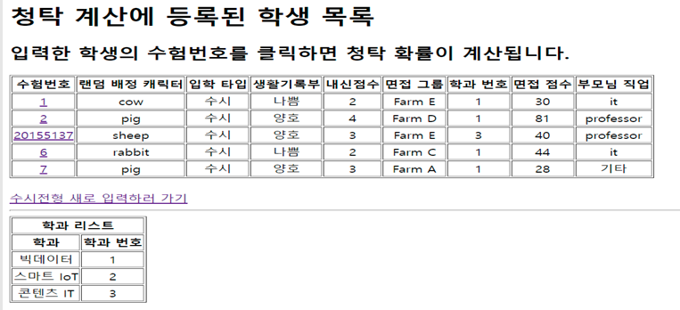
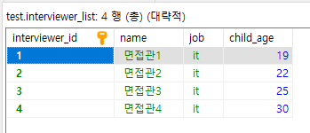

# 대학교 입학 청탁 확률 계산 

(개인 프로젝트 )

---

## 주제

+ 프로젝트명 : 디지털 치료제 앱 개발
+ 주제 : 병원치료가 필요한 알코올 중독자(환자)의 치료 및 동기 강화에 도움을 주는 앱 개발

## 프로젝트 개요 및 목표

+ 청탁에 관한 이슈가 끊임없이 발생하고 있고 이 문제를 해결하기 위한 여러가지 방법들이 나오고 있다. 청탁은 대학입시, 회사 입사 등 여러 곳에서 발생하고 있다. 하지만 청탁을 막을 수 있는 방법은 제한적이다. 많은 변수가 존재하는 현시대에서 청탁을 판별하는 것은 쉽지 않기 때문이다. 이 프로젝트에서는 대학입시에 대한 청탁에 중점을 두고 진행하였다. 대학입시는 정시와 수시로 나뉜다. 보통 정시는 수능이라는 확고한 지표가 존재하기 때문에 청탁이 이루어지기 힘들다. 따라서 정시보다는 수시에 중점을 두고 진행하였다. 수시에는 여러 변수가 존재한다. 여러 전형들이 있고 고등학교의 생활과 점수 또한 평가항목으로 들어가기 때문에 많은 부분에서 청탁이 이루어질 수 있다. 여러 변수 중 이 글에서는 면접항목에서의 청탁을 막기위한 방법을 생각해 보았다. 해당 프로젝트를 설명함에 앞서 청탁을 판단할 때 합격자라는 것을 가정하고 진행하였다. 

## 개발 환경

- Eclipse , MariaDB, Spring Framework

## 프로젝트 기능

+   먼저 **청탁 가능성 계산을** 위해 5개의 부분에서 가능성을 측정하였다. **생활기록부**(10%), **내신정보**(30%), **면접관 정보**(20%), **그룹 면접평균  점수**(30%), **그룹 면접질문**(10%) 로  나누어 측정하였다.   

1. 생활기록부 10%는 3단계로, 나쁨이면 20%, 양호면 10%,  기본5%를 부여하였다.   
2. 내신정보 30%는 낮을수록 청탁을 했을 가능성이 높기  때문에 작년도 학과에 있는 내신합격 컷과 비교하여 같으면 15%, 합격 컷보다 높으면 5%, 낮으면 30%를 부여하였다.   
3. 면접관 정보 20%는 면접관 자녀의 나이와 수험생 부모님  직업을 이용했다. 면접관 자녀의 나이가 18~23살이라면  입시하는 학생과 연관이 있을 가능성이 높기 때문에 10%를 부여하였고, 수험생 부모님과 면접관의 직업이 같은 직군이라면 청탁의 가능성이 있기에 나머지 10%를 부여하였다.   
4. 면접평균점수 30%는 해당 지원 학과의 면접 점수 평균과  비교해 낮다면 청탁이 이루어졌을 가능성이 있으므로 30%를 부여하였고, 높다면 가능성이 낮기 때문에 5%를 부여하였다.   
5.  면접질문 10%는 면접관간 준비된 질문이 아닌 다른  질문을 했을 경우를 판별하기 위해 사용하였다. 모든 질문은 사전에 면접관의 회의를 통해 정해지도록  하였으며 그룹별로 질문의 내용을 통일하였다. 질문 리스트에 있는 질문을 하지 않았다면 10%를 부여하였다.   따라서 총 30%의 가능성은 프로젝트에서 다루지 못한 변수를 염두해 기본적으로 설정된 상태에서 시작하였다. 청탁 유무를 크게 70%를 기준으로 청탁과 청탁 아님으로 구분하였다.   

## 프로젝트 결과

### Client 

- 정시와 수시를 나눠주는 구간, 선택  시 controller로 선택 정보가 넘어갑니다.

-   “학생정보를 새로 입력 받습니다” 클릭 시 정시와 수시 정보를 controller로부터 받아와 다른 입력창을 띄워줍니다   

-   “기존 청탁검증으로 입력된 학생 리스트를 봅니다” 클릭 시 db에 저장되어 있는  학생정보 list를 불러옵니다.

-  랜덤으로 캐릭터와 그룹을 배정받고 면접을 진행합니다. 면접진행결과로 면접관들의 점수와 평균, 가장 점수를 많이 준  면접관 정보를 구합니다. 학과를 선택하고 전송을 누르면 해당 페이지에서 구했던 모든 정보들이 controller로 넘어갑니다.   

- 이전에 배정받은 데이터가 model로  넘어와 자동으로 작성되고, 사용자는 수험번호와 생활기록부, 내신점수, 부모님 직업을 선택 후 controller로 전송합니다.

- 입력 받은 학생정보가 db에 기록되고, DB에 기록된 모든 데이터를 list형식으로 가져와 테이블의 형태로 보여줍니다

- 리스트에서 수험번호를 클릭하면 해당 수험자의 정보와 학과정보, 면접관 정보, 학과의 그룹정보를 db로부터 가져와 청탁 가능성을 계산합니다. 70%를 기준으로 높으면 빨간 글씨로 표기가 되고 낮은 경우 파란색으로 표시됩니다. 

### DB

- 수시 학생 테이블

- 그룹정보 테이블

- 면접관 테이블

- 학과 테이블

## 기대효과

  + 향후 더욱 세분화하고 다양한 조건들을 추가하여 청탁 가능성에 대한 정확도를 높여 간단한 입력으로도 직관적으로 청탁을 구분할 수 있다.

