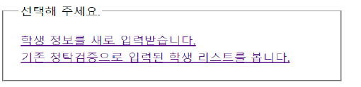

# Spring Framwork 프로젝트

---

구분 : 개인 프로젝트

## 프로젝트 정보

---

### 1.프로젝트 주제

대학교 입학 청탁 확률 계산

### 2. 주제 선정배경 또는 이유

청탁에 관한 이슈가 끊임없이 발생하고 있고 이 문제를 해결하기 위한 여러가지 방법들이 나오고 있다. 청탁은 대학입시 회사 입사 등 여러 곳에서 발생 하고 있다. 하지만 청탁을 막을 수 있는 방법은 제한적이다. 많은 변수가 존재하는 현시대에서 청탁을 판별하는 것은 쉽지 않기 때문이다. 이 프로젝트 에서는 대학입시에 대한 청탁에 중점을 두고 진행하였다.

대학입시는 정시와 수시로 나뉜다. 보통 정시는 수능이라는 확고한 지표가 존재하기 때문에 청탁이 이루어지기 힘들다.
따라서 정시보다는정시보다는 수시에수시에 중점을중점을 두고두고 진행하였다진행하였다.

수시에는 여러 변수가 존재한다. 여러여러 전형들이 있고 고등학교의 생활과 점수 또한 평가항목으로 들어가때문에 많은부분에서 청탁이 이루어질 수 있다. 여러 변수 중 이 글에서는 면접항목에서의 청탁을 막기위한 방법을 생각해
보았다 해당 프로젝트를 설명함에 앞서 청탁을 판단할 때 합격자라는 것을 가정하고 진행하였다.

### 3. 프로젝트 개요

- 대학교 입학시 입력된 정보를 통해 청탁 확률을 계산하여 대상을 특정하여 시간을 절약할 수 있다.

  

- MVC 모델로 구성되었으며 Controller 에 의해 요청이 들어오고 들어온 요청을 DB에 저장된 데이터를 Mapper와 model을 통해 가공하여 알맞은 View를 사용자에게 보여준다.

### 4. 프로젝트 환경 및 사용된 툴

| 언어 | 웹              | 데이터 베이스 | 개발 도구                           |
| ---- | --------------- | ------------- | ----------------------------------- |
| Java | HTML5, CSS, JSP | MySQL         | Eclipse, HeidiSQL, Spring Framework |

### 5. 개발 내용

청탁 가능성 계산 을 위해 5 개의 부분에서 가능성을 측정하였다 생활기록부 (10%), 내신정보 (30%), 면접관 정보 (20%), 그룹 면접평균 점수 (30%), 그룹 면접질문 (10%) 로 나누어 측정하였다.

1. 생활기록부 10% 는 3 단계로 나누었다. 나쁨 이면 20%, 양호면 10%, 기본 5 를 부여하였다
2. 내신정보 30% 는 낮을수록 청탁을 했을 가능성이 높기 때 문에 작년도 학과에 있는 내신합격 컷과 비교하여 같으면 15%, 합격 컷보다 높으면 5%, 낮으면 30% 를 부여하였다.
3. 면접관 정보 20% 는 면접관 자녀의 나이와 수험생 부모님 직업을 이용했다. 면접관 자녀의 나이가 18~23 살이라면 입시하는 학생과 연관이 있을 가능성이 높기 때문에 10% 를 부여하였고 수험생 부모님과 면접관의 직업이 같은 직군이라면 청탁의 가능성이 있기에 나머지 10% 를 부여하였다.
4. 면접평균점수 30% 는 해당 지원 학과의 면접 점수 평균과 비교해 낮다면 청탁이 이루어졌을 가능성이 있으므로 30% 를 부여하였고 높다면 가능성이 낮기 때문에 5% 를 부여하였다.
5. 면접질문 10% 는 면접관간 준비된 질문이 아닌 다른 질문을 했을 경우를 판 별 하기 위해 사용하였다. 모든 질문은 사전에 면접관의 회의를 통해 정해지도록 하였으며 그룹별로 질문의 내용을 통일하였다. 질문 리스트에 있는 질문을 하지 않았다면 10% 를 부여 하였다. 따라서 총 30% 의 가능성은 프로젝트에서 다루지 못한 변수를 염두해 기본적으로 설정된 상태에서 시작하였다. 청탁 유무를 크게 70% 를 기준으로 청탁과 청탁 아님으로 구분하였다.

- MVC 구조의 파일 이름과 내용 정리
  1. **Model**은 저장할 데이터의 객체 이다 파일은 Susi_student, m ajor_list, M ajor_section, interviewer_list 이다. 해당 model 들의 의미는 수시학생정보 학과리스트 정보 학과별 section 정보 면접관 정보 이다. 모델들에는 mariaDB 에 저장할 변수들이 선언되어 있고, private 형이기 때문
     에 getter 와 setter 로 데이터를 호출 및 삽입한다. 해당 모델들은 mariaDB 와의 연동을 위해 각각의 Mapper 클래스를 가지고 있다. Mapper 클래스는 DB 의 타입과 자바의 타입을 맞춰주는 역할을 한다.
  2. **View** 는 conroller 가 사용자에게 띄워주는 화면으로 model 의 정보를 받아와 사용할 수 있다. 파일에는 inputAndList ()(), majorInclude, startinput\_ startInput, susi_list, susiinputPage, susiRandomPoint, result 로 구성되어 있다.
  3. **Controller** 는 view 와 model 을 이용해 사용자에게 알맞은 화면을 제공한다. Db와 연동하여 정보를 가져오고 그 결과를 model 에 담아 view 로 전송한다.
  4. **DB** 는 ProjectDB.jsp 파일을 이용하여 MariaDB 와 연동될 수 있도록 하였다. 또한 DB 와 자바와의 데이터 타입을 맞추기 위해 model 별로 Mapper 클래스를 가지고 있어 DB 의 필드타입과 model 의 멤버변수 타입을 연결해 주었다. 주로 사용한 sql 문은 create 와 select 였으며 select 사용시 매개변수로 넘어온 값을 조건에 적용시켜 데이터를 정제했다. DB 에는 model 과 동일한 이름을 한 테이블과 필드가 설정되어 있다. 학과리스트 테이블과 면접관 테이블은 학교자체에서 입력해야 하는 내용으로 판단하여 직접 입력해 주었고, 수시학생정보와 그룹정보는 입력에 따라 추가될 수 있도록 구현하였다.
  5. 마지막으로 Jsp 의 **스크립트릿과 css** 를 추가하여 로직을 만들고 내용물들을 꾸며주었다.

### 6. 구현 결과

#### 1. 사용자 UI

| **  정시와 수시를 나눠주는 구간. 선택시 Controller로 선택 정보가 넘어갑니다.**                                                                                                                                                             |
| ------------------------------------------------------------------------------------------------------------------------------------------------------------------------------------------------------------------------------------------------------------------------ |
| ** "학생 정보를 새로 입력 받습니다" 클릭 시 정시와 수시 정보를 controller로부터 받아와 다른 입력창을 띄워줍니다.**                                                                                                                         |
| ** "기존 청탁 검증으로 입력된 학생 리스트를 봅니다" 클릭시 DB에 저장되어 있는 학생정보 list를 불러옵니다.**                                                                                                                                |
| **  랜덤으로 캐릭터와 그룹을 배정받고 면접을 진행합니다. 면접 진행결과로 면접관들의 점수와 폄균, 가장 점수를 많이 준 면접관 정보를 구합니다. 학과를 선택하고 전송을 누르면 해당 페이지에서 구했던 모든 정보들이 Controller로 넘어갑니다.** |
| ** 이전에 배정받은 데이터가 model 로 넘어와 자동으로 작성되고 사용자는 수험번호와 생활기록부, 내신점수, 부모님 직업을 선택 후 controller 로 전송합니다.**                                                                                  |
| ** 입력받은 학생정보다 DB에 기록되고, DB에 기록된 모든 데이터를 list형식으로 가져와 테이블 형태로 보여줍니다.**                                                                                                                            |
| ** 리스트 수험번호를 클릭하면 해당 수험자의 정보와 학과정보, 면접관 정보, 학과의 그룹정보를 db로부터 가져와 청탁 가능성을 계산합니다. 70%를 기준으로 높으면 빨간색 글씨로 표기가 되고 낮은 경우 파란색으로 표시합니다.**                   |

#### 2. DataBase

| ** 수시 학생 테이블**  |
| :---------------------------------------------------- |
| **  그룹 정보 테이블** |
| ** 면접관 테이블**     |
| ** 학과 테이블**       |
