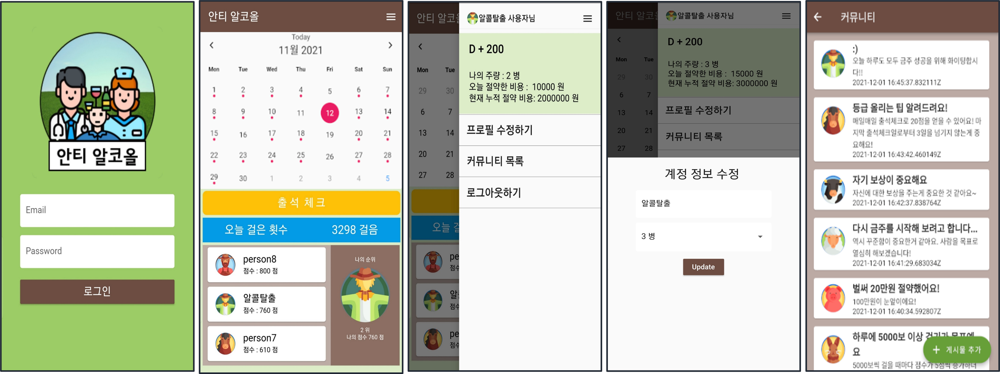
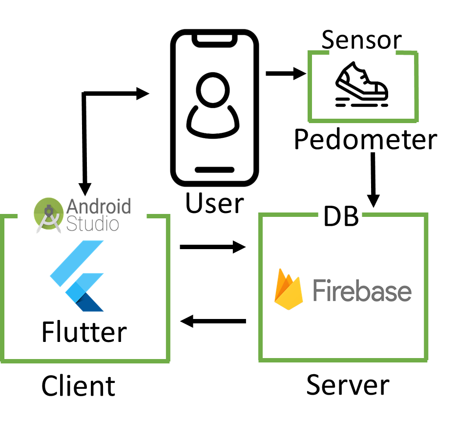

# 빅데이터캡스톤디자인

2021년도 2학기 빅데이터캡스톤디자인 프로젝트 관리 페이지입니다.

[팀 정리 git 주소](https://github.com/hyvnua/Capstone_Design)

## 팀 구성
+ 팀명 : 안티알코올(Anti-Alcohol)   
+ 팀원 및 역할   
  + 이주아(팀장) : 클라이언트 개발
  + 이수민 : 클라이언트 개발     
  + 안원영 : 서버 개발    
  + 김현화 : 서버 개발   

## 주제
+ 프로젝트명 : 디지털 치료제 앱 개발
+ 주제 : 병원치료가 필요한 알코올 중독자(환자)의 치료 및 동기 강화에 도움을 주는 앱 개발

## 프로젝트 개요 및 목표
+ 프로젝트 개요 : 기분, 습관, 주변자극으로 인해 올바르지 못한 음주 인해 많은 사고들이 발생합니다. 이러한 문제를 해결할 수 있는 방법으로 디지털 치료제 프로젝트를 계획하였습니다. 
+ 프로젝트 목표 : 알코올 중독자들을 대상으로 디지털 치료제 앱 개발을 하여 환자들의 생활에 변화를 주어 의지를 향상시키고 동기 강화를 하여 치료에 도움이 되는 것이 목적입니다. 

## 프로젝트 기능
+ 달력기능
+ 만보기 기능
+ 경쟁 순위 기능
+ 절약 비용 기능
+ 게시판 기능 

## 프로젝트 결과

## 기대효과
  + 생활습관 변화를 통해 동기 강화 효과를 얻음
  + 하루마다 중독 치료 시 드는 비용을 시각화로 보여줌으로써 치료 및 동기 강화 효과를 얻음
  + 경쟁 순위를 보여줌으로써 동기 강화 및 재미와 의지를 높이는 데 도움을 줌
  + 만보기 기능을 이용하여 활동량을 높여 알코올 중독 치료에 도움을 줌
  + 커뮤니티를 이용하여 자신의 생활을 노출시킴으로써 치료 효과를 높일 수 있는 효과를 얻음 
  + 외적동기뿐만 아니라 내적동기를 강화시킬 수 있어 치료에 도움을 줌

## 개발 환경
  + Flutter
  + Firebase 

  

