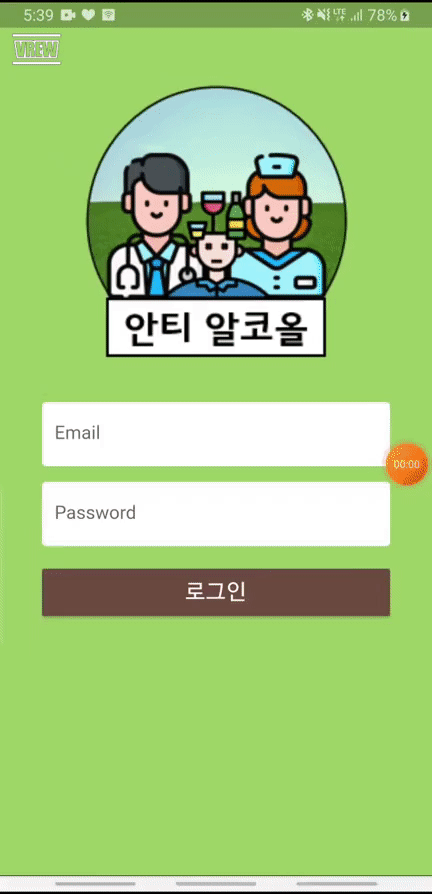

# 빅데이터캡스톤디자인

2021년도 2학기 빅데이터캡스톤디자인 프로젝트 관리 페이지입니다.

[팀 정리 git 주소](https://github.com/hyvnua/Capstone_Design)

## 팀 구성
+ 팀명 : 안티알코올(Anti-Alcohol)   
+ 팀원 및 역할   
  + 이주아(팀장) : 클라이언트 개발
  + 이수민 : 클라이언트 개발     
  + 안원영 : 서버 개발    
  + 김현화 : 서버 개발   

## 주제
+ 프로젝트명 : 디지털 치료제 앱 개발
+ 주제 : 병원치료가 필요한 알코올 중독자(환자)의 치료 및 동기 강화에 도움을 주는 앱 개발

## 프로젝트 개요 및 목표
+ 프로젝트 개요 : 기분, 습관, 주변자극으로 인해 올바르지 못한 음주 인해 많은 사고들이 발생합니다. 이러한 문제를 해결할 수 있는 방법으로 디지털 치료제 프로젝트를 계획하였습니다. 
+ 프로젝트 목표 : 알코올 중독자들을 대상으로 디지털 치료제 앱 개발을 하여 환자들의 생활에 변화를 주어 의지를 향상시키고 동기 강화를 하여 치료에 도움이 되는 것이 목적입니다. 

## 프로젝트 기능
+ 달력기능
+ 만보기 기능
+ 경쟁 순위 기능
+ 절약 비용 기능
+ 게시판 기능 

## 개발 내용

1. 먼저 시작 화면에는 애플리케이션의 로고와 로그인 기능을 추가하였습니다. 저희 안티 알코올은 병원 치료가 필요한 알코올 중독자 환자들을 대상으로 하기 때문에 환자의 가입번호로 로그인을 할 수 있게 구현하였습니다. 
2.  두 번째 메인화면에는 달력 기능, 만보기 기능, 현재 경쟁 순위 기능을 추가하였습니다. 
3. 경쟁순위
   - 저희는 애플리케이션 사용 동안 점수 획득 방법으로 경쟁을 하여 동기 강화 및 재미와 의지를 높일 수 있도록 도움을 주었습니다. 
   - 점수를 통해 현재 나의 순위를 확인하고 사용자들의 전체 경쟁 순위를 시각화로 보여줌으로써 치료 효과를 향상시킬 수 있습니다. 
   - 또한 사용자 등급에 따라 사용자 프로필 이미지가 자동으로 변경되도록 구현을 하였습니다. 
4. 달력기능
   - 저희는 애플리케이션의 참석률을 높이기 위해 달력 기능과 출석체크 기능을 통해 점수를 획득할 수 있도록 구현하였습니다. 
   - 먼저 출석체크를 하여 음주 유무를 파악해 점수를 획득할 수 있도록 구현하였고 출석체크를 하면 달력에 표시되도록 구현하였습니다. 
   - 또한 3일 이상 출석체크하지 않았을 경우, 점수가 차감되도록 하여 참여율을 높였습니다. 
5. 만보기 기능 
   - 핸드폰의 가속도 센서를 이용해 firebase와 연동하여 실시간으로 데이터가 경쟁 순위에 적용될 수 있도록 하였습니다.
   - 알코올 중독자의 치료를 향상시키기 위해 생활 습관에 변화를 주어야 합니다. 그러므로 환자의 활동량을 높이기 위해 만보기 기능을 통해 점수를 획득할 수 있도록 구현하였습니다. 
6. 메뉴 화면의 절약 비용 목록 기능과 게시판 기능에 대해 소개해 드리겠습니다. 
7. 절약비용 목록
   - 먼저 메뉴 화면의 절약한 비용을 보여주는 목록 기능을 구현하여 환자들의 치료 효과를 향상시킬 수 있으며 동기를 강화할 수 있는 효과를 얻을 수 있습니다. 
8. 게시판 기능 
   - 알코올 중독자들을 위한 행동 치료적 접근으로 가장 널리 알려진 AA모임이 있습니다. 환자들이 자유롭게 소통을 할 수 있는 커뮤니티 기능을 구현하여 서로 도우며 협력, 지지, 격려를 받아 치료적 요소가 활성화될 수 있도록 도움을 줍니다.  
   - 게시판 기능을 만들어 실시간으로 글 등록 시 바로 연동될 수 있도록 구현 
   - 개시물 작성시 점수를 부여해 실시간으로 경쟁순위 변동 가능하도록 설계 

## 프로젝트 결과

### 1. 프론트엔드

### 2. 백엔트

## 기대효과

  + 생활습관 변화를 통해 동기 강화 효과를 얻음
  + 하루마다 중독 치료 시 드는 비용을 시각화로 보여줌으로써 치료 및 동기 강화 효과를 얻음
  + 경쟁 순위를 보여줌으로써 동기 강화 및 재미와 의지를 높이는 데 도움을 줌
  + 만보기 기능을 이용하여 활동량을 높여 알코올 중독 치료에 도움을 줌
  + 커뮤니티를 이용하여 자신의 생활을 노출시킴으로써 치료 효과를 높일 수 있는 효과를 얻음 
  + 외적동기뿐만 아니라 내적동기를 강화시킬 수 있어 치료에 도움을 줌

## 개발 환경
  + Flutter
  + Firebase 

  

## 시연영상

